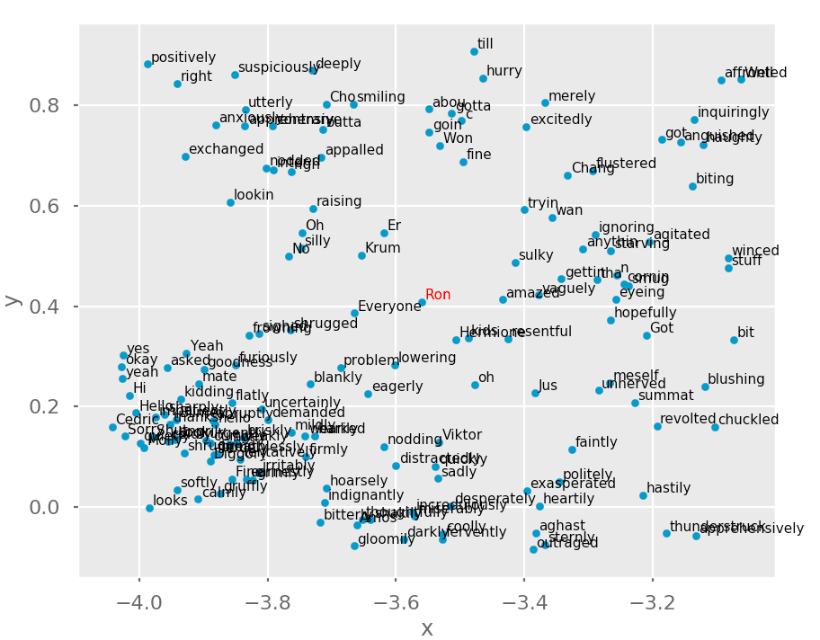

# Word Embedding Visualizer


## About 
This code repository contains a mechanism to view how words are represented "under-the-hood" in Gensim's implementation of ***Word2Vec***, which is a two-layer neural network trained to reconstruct linguistic contexts of words.

## Usage
Run the following commands in your terminal to get set up:
```
git clone https://github.com/gkeglevich/word-embedding-visualizer.git <folder_name>
pip3 install -r requirements.txt
python3 word_to_vec.py
```

You can now specify a path from which you can load pre-trained points, save points to, or label the words around a given keyword.

Note that we have provided all of the Harry Potter books inside the Corpus folder, you can replace these with any files containing the .txt extension; the program will then analyze your provided files.

## Sample Walkthrough
```
Would you like to save the trained points to a path? y/n
y
Please enter the relative path where you would like to load from:
./trained/saved_points
Would you like to save the trained points to a path? y/n
n
Would you like to label the area around a specific word in your corpus? y/n
y
Please enter the word:
Ron
Finding word...
```
At this point, a popup box containing the full graph, as well as the selected area will appear.


Notice how the word that you selected is highlighted


## License
The source code is licensed under the [MIT License](LICENSE).
